### Hi there 👋

I'm Arnaud ASSAD, aka Arhuman.

I design and build software systems that stay simple enough to understand, verify, and operate. Then I build my own products on the same principles, to make sure they hold up in practice.

Founder at [Doolta](https://www.doolta.com): Fractional CTO, Go/Cloud-Native architecture, and technical audits for teams that need to get a complex system back under control.

**Three systems that show how I work:**

- 🔍 [**mAPI-ng**](https://www.mapi-ng.com) ([source](https://github.com/arhuman/maping)): Go API observability that answers "why is this slow?" with a falsifiable diagnosis instead of a wall of dashboards.
- 🧠 [**Mnemos**](https://github.com/arhuman/mnemos): local-first memory for AI agents. Every answer cites the exact file, section, and line it came from. No vector DB, no cloud, one binary.
- 🧾 **Moontill**: an offline-first PWA point of sale, in real daily use by an independent shop. Architecture carried all the way to production, not just to prototype. [Case study](https://www.doolta.com/en/project/moontill/)

The rest of the lab (Minexus, Metarc, Prooflog, Asheeve, YVO Cloud) is at [doolta.com/project](https://www.doolta.com/en/project/).

⚡ Also true about me:
* Perl Monger since the 90s (32nd Saint on Perlmonks), FOSS advocate since 1993, learning Rustacean
* Former Service Manager of the French national Open Source support at Capgemini
* I teach, I [blog](https://blog.assad.fr), and I produce a Go podcast: [gofr.fm](https://gofr.fm) (in French)

📬 Open to Fractional CTO engagements, technical audits, and Go/Cloud-Native architecture work: [doolta.com/contact](https://www.doolta.com/en/contact/)

### Recent OSS activity

